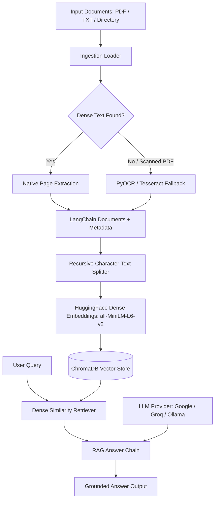

# ⚡ OmniRAG — Universal Dense Retrieval & Document Intelligence Framework

[](https://opensource.org/licenses/MIT)
[](https://www.python.org/downloads/)
[](https://www.trychroma.com/)
[](https://python.langchain.com/)

A modular, production-ready Python framework for building **Dense Retrieval-Augmented Generation (RAG)** systems using **ChromaDB**, **HuggingFace Dense Embeddings**, and multi-provider LLM integrations (**Google Gemini**, **Groq**, and **Ollama**).

---

## 🌟 Overview

**OmniRAG** transforms any collection of PDF documents, scanned files, or text notes into an intelligent, queryable document knowledge base. It includes an automated OCR fallback pipeline, page-aware recursive text splitting, persistent vector indexing, and plug-and-play LLM answer generation with strict anti-hallucination prompts.

---

## ✨ Features

- **📑 Generic Multi-Format Ingestion**: Ingest single PDF files, text documents, or entire directory trees (`.pdf`, `.txt`) recursively.
- **👁️ Automated OCR Pipeline**: Built-in PyOCR / Tesseract support for scanning image-based PDFs seamlessly.
- **🧩 Page-Aware Text Chunking**: Context-preserving recursive splitting with metadata tracking and configurable overlap.
- **⚡ Dense Vector Search**: High-performance semantic similarity matching using ChromaDB and `sentence-transformers/all-MiniLM-L6-v2`.
- **🔀 Multi-Provider LLM Integration**: Dynamically switch between **Google Gemini**, **Groq (Llama 3.1)**, and local offline **Ollama** models via simple CLI flags.
- **🛡️ Strict Anti-Hallucination Guardrails**: Specialized system prompt instructions to guarantee document-grounded answers.
- **🧪 Comprehensive Test Suite**: 100% unit-tested with Pytest.

---

## 🏗️ Architecture



---

## 📁 Repository Structure

```text
omnirag/
├── config/
│   ├── __init__.py
│   └── settings.py          # Centralized configuration & hyperparameter defaults
├── chunking/
│   ├── __init__.py
│   └── text_splitter.py     # Recursive character text splitting with metadata preservation
├── embeddings/
│   ├── __init__.py
│   └── dense_embeddings.py  # HuggingFace dense embeddings initializer
├── ingestion/
│   ├── __init__.py
│   └── document_loader.py   # Unified PDF, OCR fallback, and TXT loader
├── llm/
│   ├── __init__.py
│   ├── prompts.py           # Anti-hallucination system & RAG chat prompts
│   └── providers.py         # Unified LLM provider factory (Google, Groq, Ollama)
├── retrieval/
│   ├── __init__.py
│   └── rag_chain.py         # Dense similarity retriever & question-answering chain
├── vectorstore/
│   ├── __init__.py
│   └── chroma_store.py      # ChromaDB persistence, creation, and loading
├── utils/
│   ├── __init__.py
│   └── helpers.py           # Logging configuration & recursive file discovery
├── tests/                   # Pytest automated test suite
│   ├── conftest.py          # Shared fixtures
│   ├── test_chunking.py     # Chunking and splitting tests
│   ├── test_generation.py   # Prompt and provider factory tests
│   ├── test_ingestion.py    # Document loading and file discovery tests
│   └── test_vector_store.py # Vector store validation tests
├── rag.py                   # Command-line interface entry point
├── requirements.txt         # Production dependencies
├── .env.example             # Environment variable template
├── .gitignore               # Ignored files, virtual environments, and caches
├── CONTRIBUTING.md          # Contribution guidelines
└── LICENSE                  # MIT License
```

---

## 🚀 Quickstart

### 1. Installation

Clone the repository and install dependencies:

```bash
git clone https://github.com/mubashir-sohail-dev/omnirag.git
cd omnirag
python -m venv venv
source venv/bin/activate  # On Windows: venv\Scripts\activate
pip install -r requirements.txt
```

> **Prerequisites for Scanned PDFs:**  
> Ensure **Tesseract OCR** and **Poppler** are installed on your system if you plan to run OCR on image-based PDFs:
> - **Linux**: `sudo apt-get install tesseract-ocr poppler-utils`
> - **macOS**: `brew install tesseract poppler`
> - **Windows**: Install [Tesseract for Windows](https://github.com/UB-Mannheim/tesseract/wiki) and [Poppler for Windows](https://github.com/oschwartz10612/poppler-windows/releases) and add them to your `PATH`.

### 2. Environment Setup

Copy `.env.example` to `.env` and set your API keys:

```bash
cp .env.example .env
```

Example `.env` contents:
```env
GOOGLE_API_KEY=your_google_api_key_here
GROQ_API_KEY=your_groq_api_key_here
```

---

## 💻 CLI Usage

### Ingesting Documents

You can ingest single files or entire folders containing `.pdf` and `.txt` files:

#### Single PDF Document
```bash
python rag.py ingest path/to/document.pdf
```

#### Single Text File
```bash
python rag.py ingest path/to/notes.txt
```

#### Entire Directory Tree
```bash
python rag.py ingest ./knowledge_base
```

#### Custom Chunking & Database Parameters
```bash
python rag.py ingest ./knowledge_base --chunk-size 800 --chunk-overlap 150 --vector-db-path ./custom_db --collection-name my_docs
```

---

### Querying the Document Store

Start an interactive question-answering CLI session:

#### Google Gemini (Default)
```bash
python rag.py query --provider google
```

#### Groq (Llama 3.1 8B)
```bash
python rag.py query --provider groq
```

#### Local Ollama (Offline / Local)
```bash
python rag.py query --provider ollama --model llama3.2
```

#### Custom Retrieval Parameters
```bash
python rag.py query --provider google --k 7 --vector-db-path ./custom_db
```

---

## ⚙️ Configuration

All defaults are defined in `config/settings.py` and can be overridden via CLI flags or environment variables:

| Setting | Default Value | Environment Variable | Description |
|---|---|---|---|
| `EMBEDDING_MODEL` | `sentence-transformers/all-MiniLM-L6-v2` | `EMBEDDING_MODEL` | HuggingFace dense embedding model |
| `DEFAULT_CHUNK_SIZE` | `1000` | `DEFAULT_CHUNK_SIZE` | Maximum character length per chunk |
| `DEFAULT_CHUNK_OVERLAP` | `200` | `DEFAULT_CHUNK_OVERLAP` | Overlap between adjacent chunks |
| `DEFAULT_VECTOR_DB_PATH` | `./vector_store` | `VECTOR_DB_PATH` | Local ChromaDB database path |
| `DEFAULT_COLLECTION_NAME` | `omnirag_collection` | `COLLECTION_NAME` | ChromaDB collection name |
| `DEFAULT_PROVIDER` | `google` | `DEFAULT_LLM_PROVIDER` | Default LLM provider (`google`, `groq`, `ollama`) |
| `DEFAULT_TOP_K` | `5` | `TOP_K` | Chunks retrieved per query |

---

## 🧪 Testing

Run the full pytest suite:

```bash
python -m pytest tests/ -v
```

---

## 📄 License

Distributed under the **MIT License**. See `LICENSE` for details.
Author: [Mubashir Sohail](https://github.com/mubashir-sohail-dev)

